# Task Management + Gamification Platform: Phase 0 Architecture

## 1. Requirement Summary

Build a production-ready internal company productivity platform with Laravel, Filament, Livewire, Reverb, Echo, Redis, MySQL, queues, notifications, policies, events, listeners, jobs, scheduler, and Alpine.js where useful.

The product is not simple CRUD. It is a multi-company-ready task platform with real-time task updates, notifications, points, levels, badges, achievements, streaks, leaderboards, challenges, rewards, leave management, analytics, and auditability.

Primary goal:

> Motivate employees to complete work through real-time feedback, gamification, rankings, recognition, and rewards.

## 2. Architectural Risks and Ambiguities

### Key risks

- Scope is large and should be delivered in phases.
- Real-time features require correct channel authorization to avoid leaking company data.
- Points and rewards affect employee incentives, so the point ledger must be immutable and idempotent.
- Multi-company data isolation must be designed from the first migration.
- Gamification conditions can grow quickly, so badge and achievement rules need an extensible design.
- Dashboard metrics and leaderboards can become expensive at scale, so aggregate tables and queued recalculation are needed.

### Decisions needed before Phase 1

- Authentication stack: Laravel Breeze, Jetstream, or Filament-only admin auth.
- Whether employees use a custom Livewire dashboard outside Filament, or a separate Filament panel.
- Exact approval workflow for company join requests.
- Whether tasks require manager approval before completion points become final.
- Whether employees can assign tasks to peers by default.
- Whether role management should be global, company-scoped, or both.

Recommended defaults:

- Use Spatie Laravel Permission for roles and permissions.
- Use two Filament panels: `admin` for platform/company administration and `app` for employees if Filament is acceptable for employee UI.
- Use company memberships instead of `company_id` on users.
- Use immutable ledger transactions as source of truth for points.
- Use Redis for queue, cache, and broadcast scaling.
- Use Reverb for WebSockets and Echo on the frontend.

## 3. Module Breakdown

- Identity and access: users, roles, permissions, policies, gates.
- Company: companies, memberships, join requests, departments, teams.
- Task management: tasks, assignments, comments, attachments, tags, statuses, priorities, recurrence.
- Gamification: point rules, point transactions, XP, levels, badges, achievements, streaks.
- Leaderboards: monthly and historical company/team rankings.
- Missions and challenges: daily missions, challenge participants, progress tracking.
- Rewards: reward store, redemptions, approval, point deductions.
- Leave: leave types, policies, balances, requests, approval workflow.
- Notifications: database notifications, broadcast notifications, notification settings, sounds.
- Activity and audit: activity feed for users, immutable audit logs for critical events.
- Reporting and analytics: dashboards, exports, scheduled aggregates.
- Realtime infrastructure: events, private channels, queue listeners, Echo components.

## 4. Database Design

### Identity

#### users

Stores login identity and user profile.

Important columns:

- `id`
- `name`
- `email`
- `password`
- `avatar_path`
- `timezone`
- `locale`
- `is_active`
- `last_login_at`
- timestamps
- soft deletes

#### roles, permissions, model_has_roles, model_has_permissions, role_has_permissions

Provided by Spatie Laravel Permission.

Use team/company scoping if needed later, but keep platform roles and company roles clearly separated in service logic.

### Company structure

#### companies

Tenant boundary for company-owned resources.

Columns:

- `id`
- `name`
- `slug`
- `code`
- `join_mode`: `open`, `approval_required`, `closed`
- `status`: `active`, `inactive`
- `settings` json
- timestamps
- soft deletes

Indexes:

- unique `slug`
- unique `code`
- index `status`

#### company_memberships

Many-to-many pivot between users and companies with role/status metadata.

Columns:

- `id`
- `company_id`
- `user_id`
- `status`: `active`, `pending`, `rejected`, `suspended`
- `title`
- `joined_at`
- `approved_by`
- `approved_at`
- timestamps
- soft deletes

Constraints:

- unique active membership per `company_id`, `user_id`
- indexes on `company_id`, `user_id`, `status`

#### company_join_requests

Auditable workflow for approval-required joins.

Columns:

- `id`
- `company_id`
- `user_id`
- `code_used`
- `status`
- `reviewed_by`
- `reviewed_at`
- `review_note`
- timestamps

#### departments

Company-level departments.

Columns:

- `id`
- `company_id`
- `name`
- `description`
- `is_active`
- timestamps
- soft deletes

#### teams

Teams inside companies and optionally departments.

Columns:

- `id`
- `company_id`
- `department_id`
- `name`
- `description`
- `lead_user_id`
- `is_active`
- timestamps
- soft deletes

#### team_memberships

Many-to-many pivot between users and teams.

Columns:

- `id`
- `team_id`
- `user_id`
- `role`: `lead`, `member`
- `joined_at`
- timestamps

Constraints:

- unique `team_id`, `user_id`

### Task management

#### task_statuses

Configurable statuses per company, with seeded defaults.

Columns:

- `id`
- `company_id` nullable for system defaults
- `name`
- `slug`
- `color`
- `sort_order`
- `is_terminal`
- `is_active`
- timestamps

#### task_priorities

Configurable priorities per company, with seeded defaults.

Columns:

- `id`
- `company_id` nullable
- `name`
- `slug`
- `weight`
- `color`
- `sort_order`
- timestamps

#### task_categories

Optional categorization per company.

#### tasks

Core task record.

Columns:

- `id`
- `company_id`
- `created_by`
- `team_id` nullable
- `task_status_id`
- `task_priority_id`
- `task_category_id` nullable
- `parent_task_id` nullable
- `title`
- `description` long text nullable
- `due_at`
- `estimated_minutes`
- `started_at`
- `completed_at`
- `completion_comment`
- `completed_by` nullable
- `cancelled_at`
- `cancelled_by` nullable
- `recurrence_id` nullable
- `metadata` json
- timestamps
- soft deletes

Indexes:

- `company_id`, `task_status_id`
- `company_id`, `due_at`
- `company_id`, `created_by`
- `company_id`, `completed_by`
- `team_id`

#### task_assignments

Allows one or more assignees per task and supports team assignments.

Columns:

- `id`
- `task_id`
- `assignee_user_id` nullable
- `assignee_team_id` nullable
- `assigned_by`
- `status`: `assigned`, `accepted`, `completed`, `rejected`, `cancelled`
- `assigned_at`
- `completed_at`
- timestamps

Constraint:

- Require either `assignee_user_id` or `assignee_team_id`.

#### task_comments

Task discussion and completion notes.

#### task_attachments

File uploads for task proof and references.

Columns include:

- `disk`
- `path`
- `original_name`
- `mime_type`
- `size`
- `uploaded_by`

#### task_tags and task_tag

Company-scoped tags and many-to-many task tagging.

#### task_dependencies

Task dependency graph.

Columns:

- `task_id`
- `depends_on_task_id`

#### task_recurrences

Recurring task rules.

Columns:

- `company_id`
- `created_by`
- `frequency`
- `interval`
- `starts_at`
- `ends_at`
- `next_run_at`
- `rule` json
- `is_active`

### Points and gamification

#### point_rules

Configurable point rules.

Columns:

- `id`
- `company_id` nullable
- `key`
- `name`
- `points`
- `conditions` json
- `is_active`
- timestamps

Seed keys:

- `task_completed`
- `task_assignment_success`
- `on_time_bonus`
- `early_completion_bonus`
- `lucky_bonus`
- `reward_redemption`
- `point_reversal`

#### point_transactions

Immutable point ledger and source of truth.

Columns:

- `id`
- `company_id`
- `user_id`
- `task_id` nullable
- `point_rule_id` nullable
- `type`: `award`, `bonus`, `deduction`, `reversal`, `adjustment`
- `source`: event or service source
- `source_id` nullable
- `idempotency_key`
- `points`
- `description`
- `metadata` json
- `reversed_transaction_id` nullable
- timestamps

Constraints:

- unique `idempotency_key`
- indexes `company_id`, `user_id`, `created_at`
- index `task_id`

#### user_point_summaries

Cached totals for fast dashboard reads. Ledger remains source of truth.

Columns:

- `company_id`
- `user_id`
- `total_points`
- `monthly_points`
- `xp`
- `tasks_completed`
- `last_recalculated_at`

Unique:

- `company_id`, `user_id`

#### levels

Configurable XP levels.

Columns:

- `company_id` nullable
- `name`
- `required_xp`
- `icon`
- `description`
- `sort_order`
- `is_active`

#### badges

Configurable badges.

Columns:

- `company_id` nullable
- `name`
- `slug`
- `description`
- `icon`
- `rule_key`
- `requirements` json
- `points_reward`
- `is_active`

#### user_badges

Awarded badges.

Columns:

- `company_id`
- `user_id`
- `badge_id`
- `earned_at`
- `metadata` json

Unique:

- `company_id`, `user_id`, `badge_id`

#### achievements

Configurable achievement definitions.

Columns:

- `company_id` nullable
- `name`
- `slug`
- `description`
- `icon`
- `rule_key`
- `requirements` json
- `points_reward`
- `is_repeatable`
- `is_active`

#### user_achievements

Awarded achievements.

#### streaks

Server-side streak state per company/user.

Columns:

- `company_id`
- `user_id`
- `current_streak`
- `longest_streak`
- `streak_started_on`
- `last_activity_on`
- `freeze_count`
- timestamps

Unique:

- `company_id`, `user_id`

### Leaderboards

#### leaderboards

Monthly or custom leaderboard period.

Columns:

- `company_id`
- `scope_type`: `company`, `team`
- `scope_id` nullable
- `period`: `monthly`, `weekly`, `custom`
- `starts_on`
- `ends_on`
- `status`: `draft`, `active`, `finalized`
- timestamps

#### leaderboard_entries

Stores calculated ranking history.

Columns:

- `leaderboard_id`
- `user_id` nullable
- `team_id` nullable
- `rank`
- `points`
- `tasks_completed`
- `completion_rate`
- `on_time_rate`
- `metadata` json

Constraints:

- unique per leaderboard and participant

#### employee_month_awards

Historical employee of the month winners.

Columns:

- `company_id`
- `user_id`
- `month`
- `year`
- `points`
- `tasks_completed`
- `completion_rate`
- `on_time_rate`
- `streak`
- `metadata` json

Unique:

- `company_id`, `month`, `year`

### Missions, challenges, and rewards

#### daily_missions

Mission templates or generated daily missions.

Columns:

- `company_id`
- `name`
- `rule_key`
- `goal`
- `reward_points`
- `mission_date`
- `is_active`
- `metadata` json

#### mission_progress

Per-user progress.

Columns:

- `daily_mission_id`
- `user_id`
- `progress`
- `completed_at`
- `rewarded_at`

Unique:

- `daily_mission_id`, `user_id`

#### challenges

Company or team challenges.

Columns:

- `company_id`
- `team_id` nullable
- `name`
- `description`
- `scope`: `company`, `team`
- `rule_key`
- `goal`
- `progress`
- `reward` json
- `starts_at`
- `ends_at`
- `status`

#### challenge_participants

Users or teams enrolled in challenges.

#### rewards

Reward store items.

Columns:

- `company_id`
- `name`
- `description`
- `cost_points`
- `stock`
- `is_active`
- `requires_approval`
- timestamps
- soft deletes

#### reward_redemptions

Employee redemptions.

Columns:

- `company_id`
- `reward_id`
- `user_id`
- `status`: `pending`, `approved`, `rejected`, `cancelled`, `fulfilled`
- `cost_points`
- `point_transaction_id` nullable
- `reviewed_by`
- `reviewed_at`
- `review_note`
- timestamps

### Leave management

#### leave_types

Configurable leave types per company.

#### leave_policies

Rules for accrual, limits, and carry-over.

#### leave_balances

Per user, leave type, and year.

#### leave_requests

Columns:

- `company_id`
- `user_id`
- `leave_type_id`
- `starts_on`
- `ends_on`
- `duration_days`
- `reason`
- `status`
- `approved_by`
- `approved_at`
- `rejected_by`
- `rejected_at`
- `review_note`
- timestamps

### Notifications, settings, audit

#### notifications

Use Laravel database notifications. Store structured data:

- `type`
- `notifiable_type`
- `notifiable_id`
- `data` json
- `read_at`

#### notification_settings

Per user/company notification preferences.

Columns:

- `company_id`
- `user_id`
- `sounds_enabled`
- `sound_volume`
- `channels` json

#### activity_logs

User-facing timeline.

Columns:

- `company_id`
- `actor_id`
- `subject_type`
- `subject_id`
- `event`
- `description`
- `metadata` json
- timestamps

#### audit_logs

Immutable security and business audit trail.

Columns:

- `company_id` nullable
- `actor_id` nullable
- `action`
- `auditable_type`
- `auditable_id`
- `before` json nullable
- `after` json nullable
- `ip_address`
- `user_agent`
- `metadata` json
- timestamps

#### company_settings

Company-specific settings.

#### gamification_settings

Company-specific gamification controls.

#### system_settings

Platform-wide settings.

## 5. Relationship Analysis

### One-to-one

- Company membership has one user point summary for the same user/company.
- User has one notification setting per company.
- User has one streak record per company.

### One-to-many

- Company has many memberships.
- Company has many departments, teams, tasks, point transactions, levels, badges, achievements, rewards, leave requests.
- User creates many tasks.
- User completes many tasks.
- Task has many comments, attachments, assignments, point transactions.
- Reward has many redemptions.
- Leave type has many leave requests.

### Many-to-many

- Users belong to many companies through company memberships.
- Users belong to many teams through team memberships.
- Tasks have many tags through task_tag.
- Users earn many badges through user_badges.
- Users earn many achievements through user_achievements.
- Challenges have many participants.

### Polymorphic

- Activity logs can reference many subject types.
- Audit logs can reference many auditable types.
- Notifications use Laravel's polymorphic notifiable model.
- Attachments can later be generalized if comments, leave requests, or rewards need files.

### Immutable transaction tables

- `point_transactions`
- `audit_logs`
- `leaderboard_entries` after finalization
- `employee_month_awards`

## 6. Mermaid ERD

```mermaid
erDiagram
    USERS ||--o{ COMPANY_MEMBERSHIPS : joins
    COMPANIES ||--o{ COMPANY_MEMBERSHIPS : has
    COMPANIES ||--o{ DEPARTMENTS : has
    COMPANIES ||--o{ TEAMS : has
    DEPARTMENTS ||--o{ TEAMS : contains
    TEAMS ||--o{ TEAM_MEMBERSHIPS : has
    USERS ||--o{ TEAM_MEMBERSHIPS : belongs

    COMPANIES ||--o{ TASKS : owns
    USERS ||--o{ TASKS : creates
    USERS ||--o{ TASKS : completes
    TEAMS ||--o{ TASKS : scopes
    TASK_STATUSES ||--o{ TASKS : classifies
    TASK_PRIORITIES ||--o{ TASKS : prioritizes
    TASKS ||--o{ TASK_ASSIGNMENTS : has
    USERS ||--o{ TASK_ASSIGNMENTS : assigned
    TEAMS ||--o{ TASK_ASSIGNMENTS : assigned
    TASKS ||--o{ TASK_COMMENTS : has
    TASKS ||--o{ TASK_ATTACHMENTS : has
    TASKS ||--o{ POINT_TRANSACTIONS : produces

    COMPANIES ||--o{ POINT_RULES : configures
    USERS ||--o{ POINT_TRANSACTIONS : earns
    COMPANIES ||--o{ POINT_TRANSACTIONS : records
    POINT_RULES ||--o{ POINT_TRANSACTIONS : calculates
    USERS ||--o{ USER_POINT_SUMMARIES : summarizes
    COMPANIES ||--o{ USER_POINT_SUMMARIES : summarizes

    COMPANIES ||--o{ LEVELS : configures
    COMPANIES ||--o{ BADGES : configures
    BADGES ||--o{ USER_BADGES : awarded
    USERS ||--o{ USER_BADGES : earns
    ACHIEVEMENTS ||--o{ USER_ACHIEVEMENTS : awarded
    USERS ||--o{ USER_ACHIEVEMENTS : earns
    USERS ||--o{ STREAKS : tracks

    COMPANIES ||--o{ LEADERBOARDS : has
    LEADERBOARDS ||--o{ LEADERBOARD_ENTRIES : ranks
    USERS ||--o{ LEADERBOARD_ENTRIES : ranked
    TEAMS ||--o{ LEADERBOARD_ENTRIES : ranked

    COMPANIES ||--o{ DAILY_MISSIONS : creates
    DAILY_MISSIONS ||--o{ MISSION_PROGRESS : tracks
    USERS ||--o{ MISSION_PROGRESS : completes

    COMPANIES ||--o{ CHALLENGES : creates
    CHALLENGES ||--o{ CHALLENGE_PARTICIPANTS : includes

    COMPANIES ||--o{ REWARDS : offers
    REWARDS ||--o{ REWARD_REDEMPTIONS : redeemed
    USERS ||--o{ REWARD_REDEMPTIONS : requests

    COMPANIES ||--o{ LEAVE_TYPES : configures
    LEAVE_TYPES ||--o{ LEAVE_REQUESTS : classifies
    USERS ||--o{ LEAVE_REQUESTS : requests

    COMPANIES ||--o{ ACTIVITY_LOGS : records
    COMPANIES ||--o{ AUDIT_LOGS : audits
```



## 7. Role and Permission Design

Use Spatie Laravel Permission. Do not scatter hard-coded role checks through controllers, Livewire components, or Filament resources.

### Initial roles

- `super_admin`: full platform access.
- `platform_admin`: manage companies, global settings, all admin resources.
- `company_admin`: manage one company's users, teams, tasks, leave, reports, settings.
- `manager`: assign and review tasks, approve leave if permitted, view team analytics.
- `team_lead`: manage team tasks and team members.
- `employee`: complete assigned work, view own dashboard, redeem rewards, request leave.
- `hr`: manage leave, holidays, employee data if permitted.

### Permission matrix

| Permission | Super Admin | Platform Admin | Company Admin | Manager | Team Lead | HR | Employee |
| --- | --- | --- | --- | --- | --- | --- | --- |
| manage platform settings | yes | yes | no | no | no | no | no |
| manage companies | yes | yes | no | no | no | no | no |
| manage company settings | yes | yes | yes | no | no | no | no |
| manage roles | yes | yes | scoped | no | no | no | no |
| manage users | yes | yes | scoped | team | team | scoped | no |
| manage teams | yes | yes | yes | team | team | no | no |
| create tasks | yes | yes | yes | yes | yes | optional | optional |
| assign tasks | yes | yes | yes | yes | team | optional | optional |
| complete own tasks | yes | yes | yes | yes | yes | yes | yes |
| modify completed tasks | yes | yes | yes | limited | no | no | no |
| manage point rules | yes | yes | yes | no | no | no | no |
| view point ledger | yes | yes | yes | team | team | no | own |
| reverse points | yes | yes | yes | no | no | no | no |
| manage badges | yes | yes | yes | no | no | no | no |
| manage rewards | yes | yes | yes | no | no | no | no |
| redeem rewards | yes | yes | yes | yes | yes | yes | yes |
| approve rewards | yes | yes | yes | optional | no | no | no |
| manage leave types | yes | yes | yes | no | no | yes | no |
| approve leave | yes | yes | yes | optional | optional | yes | no |
| view analytics | yes | yes | yes | team | team | scoped | own |
| view audit logs | yes | yes | yes | no | no | no | no |

Policies must enforce company isolation and record ownership. Permissions decide capability; policies decide whether the specific record belongs to the active company and scope.

## 8. Multi-Tenancy Strategy

- Use `companies` as tenant boundary.
- Do not store a single `company_id` on users.
- Use `company_memberships` for membership and status.
- Keep an active company context in session after login or joining.
- Derive company context server-side from authenticated memberships.
- Every company-owned query must be scoped by active company.
- Use policies and query scopes such as `forCompany($companyId)`.
- Never trust `company_id` submitted by the frontend.
- Broadcast only on private or presence channels with channel authorization.

## 9. Real-Time Architecture

### Channels

- `private-user.{userId}`: personal notifications, point changes, badge unlocks.
- `private-company.{companyId}`: company-wide announcements and leaderboard updates.
- `presence-company.{companyId}`: online presence if needed.
- `private-team.{teamId}`: team task updates and challenges.
- `private-task.{taskId}`: task comments/status updates if needed.

### Channel authorization

- User channel: authenticated user id must match.
- Company channel: user must have active company membership.
- Team channel: user must be a member of that team or have company management permission.
- Task channel: user must be creator, assignee, team member, or authorized manager in the same company.

### Frontend flow

- Laravel Echo subscribes to active user, company, and team channels.
- Livewire components listen for browser events and update only affected sections.
- Alpine notification sound manager plays sounds after first valid user interaction.
- Notification preference is loaded from `notification_settings`.
- Sound playback is throttled to prevent spam.

## 10. Event Flow Examples

### Task assigned

1. Authorized user creates or assigns task.
2. `TaskService` validates company scope and assignee.
3. Task and assignment are saved.
4. `TaskAssigned` event is dispatched after commit.
5. Listener queues notification.
6. Broadcast event updates assignee dashboard.
7. Activity and audit logs are written.

### Task completed

1. Employee clicks Complete Task.
2. `TaskCompletionService::complete($task, $user, $comment)` runs inside `DB::transaction()`.
3. Service validates task status, assignee, company membership, and idempotency.
4. Task status changes to completed.
5. Completion metadata is saved.
6. Point transactions are created:
   - assignee task completion
   - creator assignment success
   - on-time or early bonus where applicable
   - lucky bonus if rule allows
7. User point summaries are updated from ledger deltas.
8. Streak is updated.
9. Activity and audit logs are written.
10. Event `TaskCompleted` is dispatched after commit.
11. Queued listeners evaluate badges, achievements, missions, challenges, leaderboard updates, and notifications.
12. Broadcast events update dashboards without reload.

### Point reversal

1. Authorized user reopens, rejects, cancels, or invalidates a completed task.
2. `PointService::reverseForTask($task, $reason)` creates reversal transactions linked to original transactions.
3. Summaries are updated from reversal deltas.
4. Audit log records the reason and actor.
5. `PointsReversed` event broadcasts affected user dashboard changes.

## 11. Queue and Scheduler Architecture

### Queues

Suggested named queues:

- `default`
- `notifications`
- `broadcasts`
- `gamification`
- `analytics`
- `reports`

Use Redis queue driver.

Critical state changes stay synchronous inside database transactions. Queue only side effects and heavier recalculations.

### Jobs

- `SendTaskAssignedNotification`
- `SendTaskCompletedNotification`
- `SendDeadlineReminder`
- `MarkOverdueTasks`
- `ProcessAchievementCheck`
- `ProcessBadgeCheck`
- `UpdateStreak`
- `CalculateMonthlyLeaderboard`
- `FinalizeMonthlyLeaderboard`
- `GenerateDailyMissions`
- `GenerateRecurringTasks`
- `ProcessChallengeProgress`
- `SendLeaveNotification`
- `ExportReport`

### Scheduler

Run every minute:

- deadline reminders
- overdue detection
- recurring task generation

Run daily:

- mission generation
- streak maintenance
- expired challenge checks

Run monthly:

- finalize leaderboard
- calculate employee of the month
- monthly badge processing

## 12. Gamification Architecture

### PointService

Responsibilities:

- Resolve active point rules.
- Create immutable point transactions.
- Enforce idempotency.
- Create reversal transactions.
- Update user point summaries.
- Dispatch `PointsAwarded` or `PointsReversed`.

No controller, Filament resource, or Livewire component should directly mutate points.

### BadgeService and AchievementService

Use rule keys mapped to evaluator classes.

Example:

- `tasks_completed_count`
- `on_time_tasks_count`
- `consecutive_on_time_tasks`
- `daily_task_burst`
- `deadline_sprinter`
- `very_late_completion`
- `streak_days`

Each evaluator receives:

- company
- user
- triggering event model
- requirements json

This allows admins to configure thresholds without changing task completion logic.

### LevelService

- Resolve level from XP using active level records.
- Broadcast `LevelUp` when crossing thresholds.
- Keep levels company-specific or global.

### StreakService

- Server-side updates on valid task completion.
- Tracks current streak, longest streak, start date, and last activity date.
- Allows future streak freeze support.

### LeaderboardService

- Use point ledger and summaries for current month.
- Store finalized rankings in leaderboard tables.
- Company points never cross company boundaries.
- Team leaderboard uses team membership and scoped points.

## 13. Notification Architecture

Use Laravel Notifications with database and broadcast channels.

Notification data structure:

```json
{
  "category": "task",
  "event": "task_assigned",
  "title": "New Task Assigned",
  "body": "Rahim assigned you: Fix Payment Gateway",
  "company_id": 1,
  "task_id": 10,
  "actor_id": 2,
  "points": null,
  "sound": "task_assigned",
  "priority": "normal",
  "action_url": "/app/tasks/10"
}
```

Sound UX:

- Store preferences in `notification_settings`.
- Default sounds on, volume 0.5.
- Unlock audio after first user click/keypress.
- Queue sounds with debounce.
- Use different sound keys: `task_assigned`, `task_completed`, `badge`, `level_up`, `leave`, `important`.

## 14. Filament Architecture

### Panels

Recommended:

- `AdminPanelProvider`: platform and company administration.
- `EmployeePanelProvider` or custom Livewire area: employee dashboard and workflows.

### Resources

- CompanyResource
- UserResource
- RoleResource
- PermissionResource
- DepartmentResource
- TeamResource
- TaskResource
- TaskStatusResource
- TaskPriorityResource
- PointRuleResource
- PointTransactionResource
- LevelResource
- BadgeResource
- AchievementResource
- ChallengeResource
- RewardResource
- RewardRedemptionResource
- LeaveTypeResource
- LeaveRequestResource
- HolidayResource
- CompanySettingResource
- SystemSettingResource
- AuditLogResource

### Widgets

Admin dashboard:

- Companies count
- Employees count
- Active tasks
- Completed today
- Overdue tasks
- Pending leave requests
- Total points
- Active challenges
- Task completion trend
- Company performance chart
- Monthly points chart
- Top performers table
- Pending joins table

Employee dashboard:

- Greeting and active company
- Current points and level progress
- Monthly rank
- Streak
- Today's mission
- Task counters
- Pending task list
- Recent completion history
- Notification center
- Leaderboard preview

Business logic belongs in services and actions, not resource classes.

## 15. Folder Structure

```text
app/
  Actions/
    Companies/
    Tasks/
    Gamification/
    Leave/
  Events/
  Filament/
    Admin/
    Employee/
  Http/
    Controllers/
    Requests/
  Jobs/
  Listeners/
  Models/
  Notifications/
  Policies/
  Services/
    CompanyService.php
    TaskService.php
    TaskCompletionService.php
    PointService.php
    GamificationService.php
    BadgeService.php
    AchievementService.php
    LeaderboardService.php
    LeaveService.php
    NotificationService.php
  Support/
    CompanyContext.php
    Gamification/
      BadgeRuleRegistry.php
      AchievementRuleRegistry.php
      Rules/
database/
  migrations/
  seeders/
  factories/
resources/
  js/
    echo.js
    notification-sounds.js
  views/
    livewire/
routes/
  web.php
  channels.php
  console.php
tests/
  Feature/
  Unit/
docs/
```

## 16. Development Phases

### Phase 1: Foundation

- Install Filament.
- Install Spatie Laravel Permission.
- Configure auth.
- Create company, membership, department, and team models/migrations.
- Create role and permission seeders.
- Add policies for company isolation.
- Create admin Filament panel basics.

### Phase 2: Company and employee system

- Company creation and code generation.
- Join company flow.
- Approval required join requests.
- Active company selection.
- Employee/company dashboard shell.

### Phase 3: Task management

- Task models and migrations.
- Task statuses, priorities, categories, tags.
- Task assignment service.
- Task completion modal.
- Task history and activity feed.

### Phase 4: Real-time system

- Install/configure Reverb.
- Configure Echo.
- Add private channels.
- Broadcast task and notification events.
- Implement notification sound manager.

### Phase 5: Points and gamification foundation

- Point rules.
- Point ledger.
- Point summaries.
- Task completion point flow.
- Reversal flow.

### Phase 6: Levels, badges, achievements, streaks, leaderboards

- Configurable level records.
- Rule evaluators.
- Badge and achievement awarding.
- Streak tracking.
- Monthly leaderboards.

### Phase 7: Leave management

- Leave types, policies, balances, requests.
- Approval workflow.
- Notifications and audit logs.

### Phase 8: Admin analytics

- Filament widgets.
- Charts.
- Aggregated dashboard metrics.
- Export foundations.

### Phase 9: Challenges and rewards

- Reward store.
- Reward redemptions with point deductions.
- Team/company challenges.
- Challenge progress jobs.

### Phase 10: Testing, optimization, security, deployment

- Feature and unit tests for critical flows.
- Performance indexes.
- N+1 review.
- Security review.
- Production docs for queue, scheduler, Redis, Reverb, storage, mail, and deployment.

## 17. Phase 1 Implementation Plan

After confirmation, start with the smallest stable foundation:

1. Install required packages:
   - Filament
   - Spatie Laravel Permission
   - Laravel Reverb
2. Publish and configure package assets.
3. Create base company/membership/team migrations and models.
4. Create role and permission seeder.
5. Create admin user seeder.
6. Add policies and company context support.
7. Create first Filament admin resources:
   - Companies
   - Users
   - Teams
8. Add tests for:
   - role seeding
   - company membership
   - duplicate membership prevention
   - company isolation query scopes

This gives the rest of the system a secure tenant and authorization foundation.

